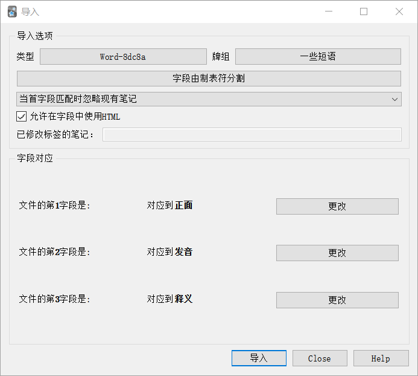
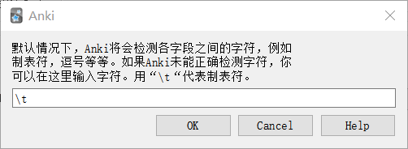
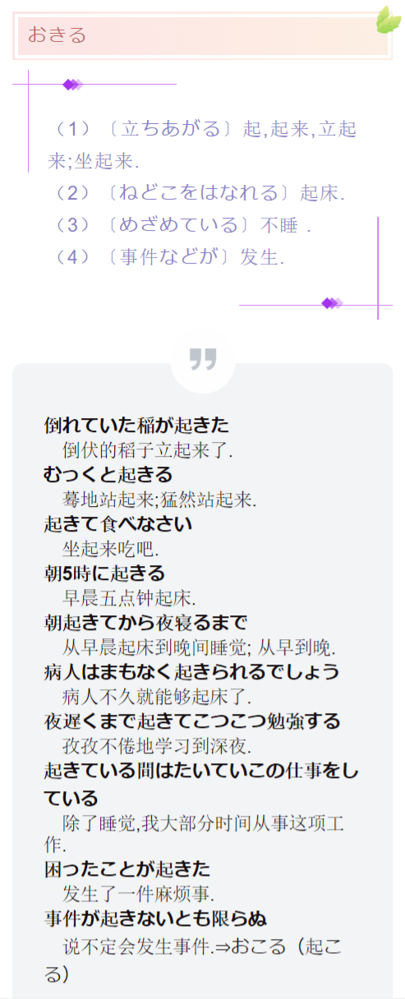

# Anki-Tango-master

自动生成可导入 [Anki](https://github.com/ankitects/anki) 的日语单词本（TXT 格式，使用**制表符**分隔字段）。单词本内容取自小学馆的《日中辞典》。

环境需求：python、pykakasi 库。

参见：
* [在 Anki 中自动添加日语真人发音](https://card.weibo.com/article/m/show/id/2309404535379217744226?_wb_client_=1)（作者：柏木优）
* [在 Anki 中新增卡片类型](https://blog.csdn.net/qq_34260368/article/details/78268080)（作者：yoohm）

## 用法

先准备好要生成的单词列表，每行一个。打开 generate.py，将单词列表输入，在最后一行后写一行 “\END”，按回车键。例如：

~~~bash
请输入单词（输入\END结束）：
弾く
服
朝
木
机
起きる
\END
~~~

程序会自动生成一个 **wordlist.txt** 文件，内容是每个单词**三个字段**（单词、发音、释义）的单词本：

~~~
弾く	 ひく	弹;［弦で］拉;［かきならす］弹奏;［つまびく］弹拨. バイオリンを弾く／拉小提琴. 琴を弾く／弹琴. 
服	 ふく	衣服;西服. 子供服／儿童服;童装. 婦人服／女装;女服. 作業服／劳动服;工作服. 服を着る／穿衣服. 服を脱ぐ／脱衣服. 
朝	 あさ	（1）朝,早晨. 朝になる／天亮; 到了早晨. 朝早くから夜おそくまで働く／起早睡晚地劳动. あの人は朝が早い／他早晨起得早. 朝がつらい／早晨懒得起来. （2）〔午前〕早上;午前. 仕事は朝何時からですか／工作早上几点钟开始? 朝は8時からです／午前八点钟开始. 『比較』“早晨”は夜明けから8朝9時までの早朝.ときに夜12時から昼12時までもさす.“早上”は広く朝をいう. 
木	 き	（1）〔樹木〕树,树木. 3本の松の木／三棵松树. 木の幹／树干. 木のしん／树心. 木の節／树节子. 木の実／树上结的果实. 木のやに／树脂. 木の陰／树阴影;树阴. 木の切り株／树伐倒后的残株. 木に止まっている鳥／落在树上的鸟儿. 木になっている果実／树上结的果实. 木に登る／爬树;上树. 木を植える／植树. 木を切る／伐树;砍树. 木を見て森を見ず／见树不见林. （2）〔材木〕木头,木材,木料. 木で造った家／用木材盖的房子; 木造房. （3）〔拍子木〕梆子. 
机	 つくえ	桌子;［読書・書きもの用］书桌,书案';［事務用］办公桌;［書きもの用］写字台;［長方形の］案. 丸い机／圆桌. 片袖机／一头沉桌子. 机に向かって仕事をする／坐在桌前工作;伏案工作. 机を並べて共に働く／并着桌子一同工作.▼郵便局などで客が記入するための机を“写字台”という。“案”は単独では用いない. 机の虫 书呆子. 
起きる	 おきる	（1）〔立ちあがる〕起,起来,立起来;坐起来. 倒れていた稲が起きた／倒伏的稻子立起来了. むっくと起きる／蓦地站起来;猛然站起来. 起きて食べなさい／坐起来吃吧. （2）〔ねどこをはなれる〕起床. 朝5時に起きる／早晨五点钟起床. 朝起きてから夜寝るまで／从早晨起床到晚间睡觉; 从早到晚. 病人はまもなく起きられるでしょう／病人不久就能够起床了. （3）〔めざめている〕不睡 . 夜遅くまで起きてこつこつ勉強する／孜孜不倦地学习到深夜. 起きている間はたいていこの仕事をしている／除了睡觉,我大部分时间从事这项工作. （4）〔事件などが〕发生. 困ったことが起きた／发生了一件麻烦事. 事件が起きないとも限らぬ／说不定会发生事件.⇒おこる（起こる） 
~~~

打开 Anki，点击导入文件，注意要勾选 “允许在字段中使用HTML” 选项，如图：

新版本的 Anki 可能会默认使用逗号分割字段，这时需要修改成制表符，如图：

Anki 默认的卡片类型中没有三个字段的，可以自定义一个新的卡片类型。依次点击添加 → 类型 → 管理 → 添加，就能添加自定义的卡片类型。具体可以查阅 Anki 的教程。

## 分离例句和释义

由于词典上是将例句和义项杂糅在一起的，每个义项下就会显示这个义项的例句。如果想将释义和例句分离成两个字段，可以运行 rearrange.py 程序，它会自动读取当前目录下的 wordslist.txt 文件并重整例句，生成一个 **wordslist2.txt** 文件，内容为单词、发音、释义、例句的**四字段**单词本。

~~~
弾く	 ひく	弹;［弦で］拉;［かきならす］弹奏;［つまびく］弹拨. 	<b>バイオリンを弾く</b> 　拉小提琴. <b>琴を弾く</b> 　弹琴. 
服	 ふく	衣服;西服. 	<b>子供服</b> 　儿童服;童装. <b>婦人服</b> 　女装;女服. <b>作業服</b> 　劳动服;工作服. <b>服を着る</b> 　穿衣服. <b>服を脱ぐ</b> 　脱衣服. 
朝	 あさ	（1）朝,早晨. （2）〔午前〕早上;午前. 	<b>朝になる</b> 　天亮; 到了早晨. <b>朝早くから夜おそくまで働く</b> 　起早睡晚地劳动. <b>あの人は朝が早い</b> 　他早晨起得早. <b>朝がつらい</b> 　早晨懒得起来. <b>仕事は朝何時からですか</b> 　工作早上几点钟开始? <b>朝は8時からです</b> 　午前八点钟开始. 『比較』“早晨”は夜明けから8朝9時までの早朝.ときに夜12時から昼12時までもさす.“早上”は広く朝をいう.
木	 き	（1）〔樹木〕树,树木. （2）〔材木〕木头,木材,木料. （3）〔拍子木〕梆子. 	<b>3本の松の木</b> 　三棵松树. <b>木の幹</b> 　树干. <b>木のしん</b> 　树心. <b>木の節</b> 　树节子. <b>木の実</b> 　树上结的果实. <b>木のやに</b> 　树脂. <b>木の陰</b> 　树阴影;树阴. <b>木の切り株</b> 　树伐倒后的残株. <b>木に止まっている鳥</b> 　落在树上的鸟儿. <b>木になっている果実</b> 　树上结的果实. <b>木に登る</b> 　爬树;上树. <b>木を植える</b> 　植树. <b>木を切る</b> 　伐树;砍树. <b>木を見て森を見ず</b> 　见树不见林. <b>木で造った家</b> 　用木材盖的房子; 木造房. 
机	 つくえ	桌子;［読書・書きもの用］书桌,书案';［事務用］办公桌;［書きもの用］写字台;［長方形の］案. 	<b>丸い机</b> 　圆桌. <b>片袖机</b> 　一头沉桌子. <b>机に向かって仕事をする</b> 　坐在桌前工作;伏案工作. <b>机を並べて共に働く</b> 　并着桌子一同工作.▼郵便局などで客が記入するための机を“写字台”という。“案”は単独では用いない. 机の虫 书呆子.
起きる	 おきる	（1）〔立ちあがる〕起,起来,立起来;坐起来. （2）〔ねどこをはなれる〕起床. （3）〔めざめている〕不睡 . （4）〔事件などが〕发生. 	<b>倒れていた稲が起きた</b> 　倒伏的稻子立起来了. <b>むっくと起きる</b> 　蓦地站起来;猛然站起来. <b>起きて食べなさい</b> 　坐起来吃吧. <b>朝5時に起きる</b> 　早晨五点钟起床. <b>朝起きてから夜寝るまで</b> 　从早晨起床到晚间睡觉; 从早到晚. <b>病人はまもなく起きられるでしょう</b> 　病人不久就能够起床了. <b>夜遅くまで起きてこつこつ勉強する</b> 　孜孜不倦地学习到深夜. <b>起きている間はたいていこの仕事をしている</b> 　除了睡觉,我大部分时间从事这项工作. <b>困ったことが起きた</b> 　发生了一件麻烦事. <b>事件が起きないとも限らぬ</b> 　说不定会发生事件.⇒おこる（起こる） 
~~~

例句和释义分离后的显示效果（内含我自定义的 CSS 样式）：

